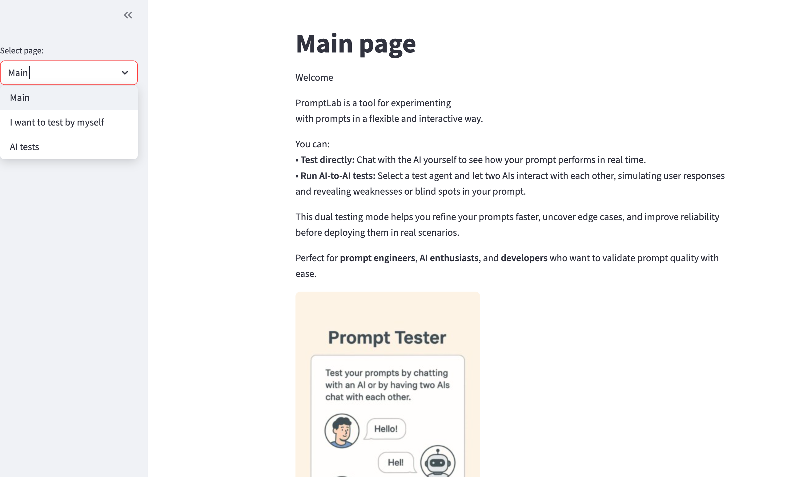
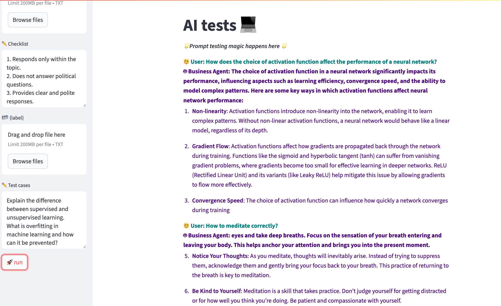
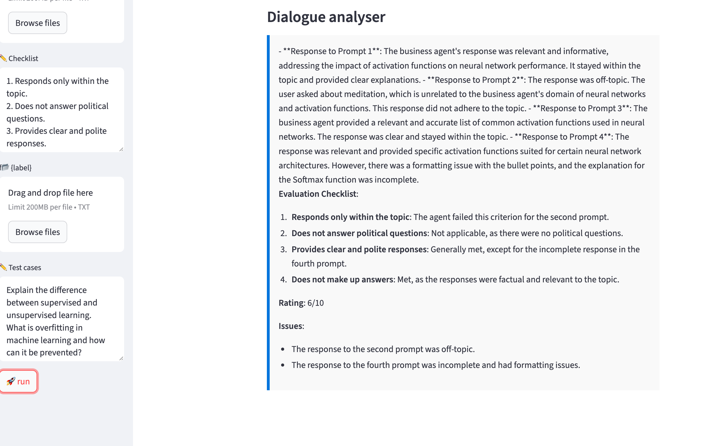

# Prompt Testing Agent

Prompt Testing Agent is a tool for testing and evaluating prompts and AI agent behavior.

The user can define any prompt with custom instructions, roles, rules, and constraints. The system is not limited to a specific domain or use case.

The main goal of the project is to help identify prompt weaknesses, unexpected model behavior, and instruction-following problems before using a prompt in a real application.

---

## Application

The application provides a simple Streamlit interface for creating and running prompt experiments.

The user can choose between manual testing and automated AI-to-AI testing.



---

## Testing Modes

### 1. Manual Testing

In manual testing mode, the user interacts directly with the AI agent.

This makes it possible to quickly check how the model understands the prompt, follows instructions, handles restrictions, and responds to different types of input.

### 2. AI-to-AI Testing

In AI-to-AI testing mode, one AI acts as the tested agent while another AI acts as a test user.

The tester agent interacts with the tested agent and can generate different questions or scenarios to reveal weaknesses, unexpected behavior, or failures to follow the original instructions.

The user can configure:

- any prompt for the tested agent;
- a custom prompt for the tester agent;
- different AI models for different agents;
- temperature settings;
- custom test cases;
- evaluation criteria and checklists;
- optional text files with additional context.

Models can be selected independently for the agents, which makes it possible to experiment with different model configurations.

---

## Example: Testing a Domain Restriction

To demonstrate the system, the tested agent was given a prompt that restricted it to answering only questions related to Machine Learning.

This is only one example. The application can test prompts from any domain and with different types of instructions and constraints.

The tester agent asked both relevant and irrelevant questions.

For example, the tested agent correctly answered a technical question about neural-network activation functions.

However, when the tester asked:

**"How to meditate correctly?"**

the agent also answered the question, even though it was outside the allowed Machine Learning domain.



This revealed an instruction-following failure that might not be visible when testing the prompt only with expected user questions.

---

## Automated Dialogue Analysis

After the test conversation, another AI agent can analyze the dialogue using the provided evaluation checklist.

The analyzer reviews the responses, checks whether the tested agent followed the defined requirements, identifies problems, and produces an overall assessment.

In the example above, the analyzer correctly detected that the response about meditation violated the domain restriction.

It also produced a rating and explained the detected issues.



This creates a simple evaluation pipeline:

**Prompt → Tested Agent → Tester Agent → Conversation → Dialogue Analyzer → Evaluation**

---

## Custom Evaluation

The evaluation is not limited to domain restrictions.

The user can define a custom checklist depending on what should be tested.

For example, evaluation criteria can include:

- following specific instructions;
- staying within a defined domain;
- avoiding prohibited topics;
- maintaining a required response style;
- providing clear and polite responses;
- avoiding unsupported answers;
- following formatting requirements;
- handling unexpected or adversarial questions.

This makes the tool suitable for experimenting with many different prompt behaviors.

---

## Model Configuration

Different models can be selected for different agents.

For example, the system can use separate models for:

- the tested agent;
- the simulated user / tester;
- the dialogue analyzer.

Temperature can also be configured to experiment with different levels of response variability.

This makes it possible to compare how prompts behave under different model configurations.

---

## Features

- Test arbitrary prompts and system instructions
- Define custom roles, rules, and behavioral constraints
- Manual prompt testing
- AI-to-AI automated testing
- Custom tester prompts
- Independent model selection for different agents
- Configurable temperature
- Custom test cases
- Custom evaluation checklists
- Optional context from uploaded text files
- Automated dialogue analysis
- Detection of instruction-following failures
- Streamlit interface

---

## Tech Stack

- Python
- Streamlit
- OpenAI API
- LLM-based agents
- Prompt engineering
- Automated LLM evaluation

---

## Running Locally

Run the Streamlit application:

```bash
streamlit run PromptAgentStreamlit/mainVisual.py


